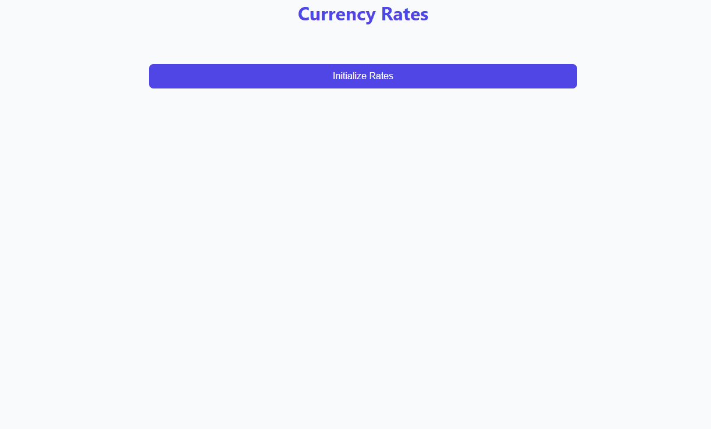

# FromBrokeToBroker: A Fullstack Currency Exchange Rate Tracker

🌟Features:
- Fetches exchange rates from the Polish National Bank API (NBP)
- Stores historical data for analysis
- Visualizes rate trends with interactive charts
- Supports multiple currencies and time periods

⚡**Tech Stack:** FastAPI, React, PostgreSQL, Docker  
🐰**Testing Stack:** Pytest, Cypress

## Preview


## Build/Configuration Instructions

### Prerequisites
- Docker and Docker Compose installed.

### Environment Setup
The application expects `backend/.env` and `backend/.env.test` to be present with the necessary configuration. The files are provided with example values.
> ℹ️ **Production Note:** Update database credentials in `backend/.env` before deploying to production environments.


### Development vs. Production
For active development, it is recommended to use the [**Test Environment**](#running-in-test-environment). Unlike the production mode, the test environment provides:
- **FastAPI hot-reload** (`--reload`): Backend automatically restarts on code changes.
- **Vite dev mode**: Frontend automatically refreshes on code changes.
- **Source code binding**: Changes made in your IDE are immediately reflected inside the containers.
- **Ephemeral Database**: The test database uses `tmpfs` (in-memory storage), so all data is automatically cleared when you run `docker compose down`.

### Running in Production Mode
To start the entire stack in production mode:
```bash
docker compose up
```
If you need to rebuild images (e.g., after changing dependencies):
```bash
docker compose up --build
```
- Frontend: [http://localhost:3000](http://localhost:3000)
- Backend API (Swagger): [http://localhost:8000/docs](http://localhost:8000/docs)

### Running in Test Environment
To run the application in the test environment (e.g., for manual verification of test data or to use the test database):
```bash
docker compose -f docker-compose.test.yaml up test-app-frontend
```
If you need to rebuild images:
```bash
docker compose -f docker-compose.test.yaml up --build
```
- Frontend: [http://localhost:3001](http://localhost:3001)
- Backend API (Swagger): [http://localhost:8001/docs](http://localhost:8001/docs)
- Test-specific endpoints (like `/test/reset-db`) are enabled in this mode.

## Testing Information

*Note: The `--rm` flag automatically removes the test container after execution, keeping your environment clean.*

### Backend Tests (pytest)
Backend tests are located in `backend/tests/`. They run against a dedicated test database defined in `docker-compose.test.yaml`.

**Run backend tests:**
```bash
docker compose -f docker-compose.test.yaml run --rm test-app pytest
```

**Adding a new backend test:**
1. Create a new file in `backend/tests/` (e.g., `test_new_feature.py`).
2. Use `pytest` fixtures and `fastapi.testclient.TestClient`.
3. Example:
   ```python
   from fastapi.testclient import TestClient
   from main import app

   client = TestClient(app)

   def test_example():
       response = client.get("/new_endpoint")
       assert response.status_code == 200
   ```

### Frontend Tests (Cypress)
Cypress tests are located in `frontend/cypress/e2e/`.

**Run frontend tests (Headless):**
```bash
docker compose -f docker-compose.test.yaml run --rm test-cypress
```
*Note: After the run, a video of the last test will be available in `frontend/cypress/videos/`. If any tests fail, screenshots will be automatically saved in `frontend/cypress/screenshots/`.*

**Adding a new frontend test:**
1. Add a new `.cy.js` file to `frontend/cypress/e2e/`.
2. Use standard Cypress commands. Note that in the test environment, the backend provides a `/test/reset-db` endpoint to ensure a clean state.

## Stopping and Cleanup

**Stop all running containers:**
```bash
# Production
docker compose down

# Test environment
docker compose -f docker-compose.test.yaml down
```

**Remove all data (reset database):**
```bash
docker compose down -v
```

## Additional Development Information

### Project Structure
- `backend/`: FastAPI application including `routers/`, `models/`, `schemas/`, `helpers/`, and `services/`.
- `frontend/`: React application using Vite and custom CSS with variables.
- `docker-compose.yaml`: Main orchestration for the app.
- `docker-compose.test.yaml`: Orchestration for the testing environment.

### Code Style
- **Python**: Follow PEP 8. Use type hints for FastAPI dependencies and function signatures.
- **Frontend**: Functional components with TypeScript. Use `tsx` for components.

### Troubleshooting
- If the database fails to start, ensure no other process is using port `5432` (or `5433` for tests).
